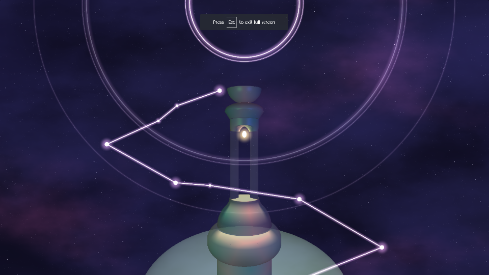

# Gris Environment Setpiece

Clemen Deng (PennKey: clemen)

This project is created using ray marched signed distance functions. Viewing this project
requires a WebGL capable browser. Resources are noted in shader, as well as the image that this project was modeled after.

[Shadertoy](https://www.shadertoy.com/view/WsSGDy)

## Features

#### Ray marched SDFs
This project incorporates the ray marched 3D SDFs, bounding boxes, and smooth blending used in the previous assignment, and additionally incorporates 2D SDFs.

#### Animation
This scene has two animated features: the blue and pink clouds move across the screen at different speeds, and the circles in the background pulse periodically.

#### Noise
This scene uses noise in three different locations: First, the background uses noise to produce a starry night sky. Then the clouds are layered on, which are implemented with fractal brownian motion with Perlin noise as a basis. Finally, the tower in the front has red coloring determined by worley noise with the location's xy coordinates as input.

#### Remapping [0, 1] to a set of colors
As stated above, the worley noise output [0, 1] is incorporated in calculating the tower color. Here it is with the red value tuned up:

#### Toolbox functions
Many toolbox functions were used in this shader, including gain and dampen for clouds, pow and mix for post processing, etc.

#### Lighting
The scene is lit with three point lights: one is the lamp in the center, and there is a greenish light to the left and bluish light to the right of the tower. There is also an ambient factor. The top of the tower has faint blue and green specular highlights to make it feel slightly shiny. Much tuning was done, very difficult to figure out how I want it to look and how to make it look that way.

#### Transparency
The tower is made transparent by using different buffers and blending the tower color with the background color.

#### Soft shadows
All lights have soft shadows. Here is the scene only lit by the lamps to make the soft shadows more apparent:

#### Bloom effect
The lamp and the other glowing 2D SDFs have a bloom effect created by using the 2D SDF distance value to interpolate between a set color and the background color.

#### Post-Processing
Post-processing effects include brightening the tower by raising to the power of 0.5 as well as saturating the colors. Additionally, the scene is vignetted, the edges are darker. This is a subtle effect because the scene is already dark but it adds more suspense.

Without post-processing:

With post-processing:

